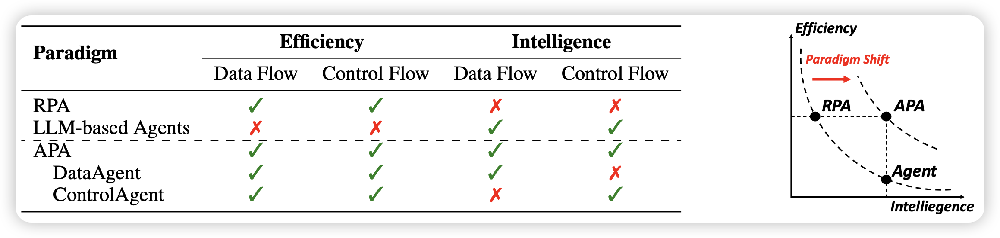

# ProAgent: From Robotic Process Automation to Agentic Process Automation


From water wheels to Robotic Process Automation (RPA), automation technology has evolved throughout history to liberate human beings from arduous tasks. Yet, RPA struggles with tasks needing human-like intelligence, especially in elaborate design of workflow construction and dynamic decision-making in workflow execution. As Large Language Models (LLMs) have emerged human-like intelligence, this paper introduces `Agentic Process Automation`(APA), a groundbreaking automation paradigm using LLM-based agents for advanced automation by offloading the human labor to agents associated with construction and execution. We then instantiate `ProAgent`, an LLM-based agent designed to craft workflows from human instructions and make intricate decisions by coordinating specialized agents. Empirical experiments are conducted to detail its construction and execution procedure of workflow, showcasing the feasibility of APA, unveiling the possibility of a new paradigm of automation driven by agents

## 

And this is the official code of `Agentic Process Automation` paper, you can download our paper [here](https://arxiv.org/abs/2311.10751).

## Code Setup

### 1. Install packages

```Shell
pip install -r requirements.txt
```

especially, We use the OpenAI version before Dev Day, so you can't use the latest version of OpenAI 

### 2. Prepare for  n8n

Our projects use a self-host n8n, you can either prepare a n8n environment and connect ProAgent with a realworld APP service. 

Or you can load our record to re-produce the case reported in our paper **without** n8n environment

> prepare a n8n service is not a eazy thing, you may face some problems or bug that we haven't encountered before, and you must handle the situation. For example, you may find some GFW problems in China when connecting your APP accounts with n8n

#### install n8n

Our projects use a self-host n8n, you must first install a n8n following the [guide](https://docs.n8n.io/hosting/installation/npm/) . You can use this command in linux/macOS

```bash
npm install n8n -g
```

self-host n8n doesn't support `https` service. However, we have already built a redirect-service, you can temporally use our service(may not be very stable, and we will opensource the redirect-service code)

```Shell
export WEBHOOK_URL=https://n8n.x-agent.net/redirect/http%3A%2F%2Flocalhost%3A5678/
n8n
```


#### Connect your account in n8n


You need to regist or connect a existing APP with n8n before launching `ProAgent`. Connecting an APP may have some APP-specific operations, you can follow the n8n credential guide [here](https://docs.n8n.io/integrations/builtin/credentials/)

#### Save credentials

Our code base needs to load the workflow ID and credential ID. So you must make some workflow and regist some apps before, then do the following commands to decode the credentials from n8n service

```Shell
n8n export:credentials --all --decrypted --output=./ProAgent/n8n_tester/credentials/c.json
```

move `c.json` to `./ProAgent/n8n_tester/credentials/c.json`

```Shell
n8n export:workflow --all --output=./ProAgent/n8n_tester/credentials/w.json
```

move `w.json` to `./ProAgent/n8n_tester/credentials/w.json`

### 

## Code Running

The running depends on a `config`， which is in `ProAgent/config.py`, you can set the running environment:

- development: This is the mode reported in paper, .
- refine: load from a existing workflow, and then refine the workflow with some new request
- production: load from a existing workflow, you can use this mode to re-produce a existing run of `ProAgent`

we have provide the case reported in our paper in `./apa_case`, you can use `production` mode to load the run directly

> we disable the test-on-change feature in production mode, And the APA-code will be test only once in the end of the run
>
> In the opposite, the refine mode enable test-on-change feature


use the following command to start `ProAgent`, if you use `development` mode, remember to start n8n before

```python
python main.py
```

> Note that we have wrote a readable record system. All of the `ProAgent` runs will generate a new record in `./records`, so you can load the run from record in `refine` or `production` mode. 

If you use the development mode, you must prepare OpenAI key first. Set the following vars in your envirnoment

```
OPENAI_API_KEY, OPENAI_API_BASE
```


The method in our code is almost the same as descripted in our paper. However something have changed after the paper released: 

- HCI: we observed some problems when `ProAgent` has some misunderstood of the problem, so we developed a feature to enable ProAgent to ask human for help by a new function-call (like XAgent). This proactive manner encourage `ProAgent` to build and test  workflows together with human.

- n8n-feature: n8n have rapidly released some new feature in parallel of our work. Our code is basically built upon an older version of n8n and we have wrote an `n8n-compiler` in our code base. So that compiler may not be compatible with the newer verison of n8n
- OpenAI: `ProAgent` is based on `GPT4-0613`. However OpenAI have released `GPT4-1106-preview` in Dev Day, which has a 38% improvment in function-calling. So you may find `ProAgent` better than our paper thanks to OpenAI's update~


## Citation

If you find this repo helpful, feel free to cite us.

```
@article{ye2023proagent,
  title={ProAgent: From Robotic Process Automation to Agentic Process Automation},
  author={Ye, Yining and Cong, Xin and Tian, Shizuo and Cao, Jiannan and Wang, Hao and Qin, Yujia and Lu, Yaxi and Yu, Heyang and Wang, Huadong and Lin, Yankai and others},
  journal={arXiv preprint arXiv:2311.10751},
  year={2023}
}
```