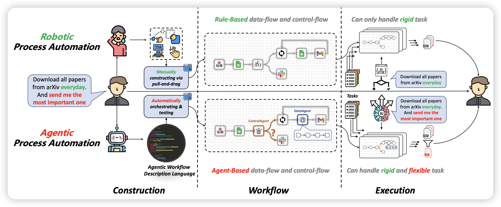
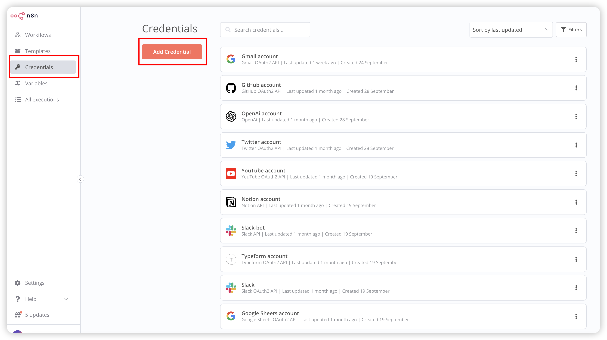

# ProAgent：从机器流程自动化到智能体流程自动化



从水车到机器流程自动化(RPA)，自动化技术在历史长河中不断发展，从繁重的任务中解放人类。然而，对于需要人类智能的任务，特别是在复杂的工作流构建和动态决策制定中，RPA却面临困境。随着大型语言模型(LLMs)的出现，人类智能已经出现，本文介绍了 `智能体流程自动化`(APA)，这是一种使用基于LLM的智能体进行高级自动化的突破性自动化范例，通过将人力劳动解放于与建设和执行相关的智能体上。我们实现了 `ProAgent`，这是一种基于LLM的智能体，它被设计来根据人类的指示制定工作流，并通过协调专门的智能体来进行复杂的决策。我们进行了实证实验，详细描述了其工作流的构建和执行过程，展示了APA的可行性，揭示了由智能体驱动的自动化新范例的可能性。

## ``

这是 `智能体流程自动化`论文的官方代码，你可以暂时在[这里](https://github.com/OpenBMB/ProAgent/blob/main/paper/paper.pdf)下载我们的论文。

## 代码设置

### 1. 安装包

```Shell
pip install -r requirements.txt
```

特别是，我们使用的是开放AI版本的开发日之前的版本，所以你不能使用最新版本的开放AI。

### 2. 准备 n8n

我们的项目使用自托管的n8n，您可以准备一个n8n环境并将ProAgent与真实的APP服务连接。

或者，您可以加载我们的记录，**无需** n8n环境即可再现我们论文中报告的案例。

> 准备一个n8n服务并不是一件容易的事情，你可能会遇到一些我们之前没有遇到过的问题或错误，你必须处理这种情况。例如，当你在中国用n8n连接你的APP账号时，你可能会遇到一些GFW的问题。

#### 安装 n8n

我们的项目使用自托管的n8n，你必须先按照[指南](https://docs.n8n.io/hosting/installation/npm/)安装一个n8n。你可以在linux/macOS中使用这个命令

```bash
npm install n8n -g
```

自托管的n8n不支持 `https`服务。然而，我们已经建立了一个重定向服务，你可以临时使用我们的服务（可能不是很稳定，我们将开源重定向服务代码）

```Shell
export WEBHOOK_URL=https://n8n.x-agent.net/redirect/http%3A%2F%2Flocalhost%3A5678/
n8n
```

#### 在n8n中连接你的账号



在启动 `ProAgent`之前，你需要注册或连接一个已经存在的APP到n8n。连接一个APP可能有一些APP特定的操作，你可以按照n8n凭证指南[这里](https://docs.n8n.io/integrations/builtin/credentials/)进行操作。

#### 保存凭证

我们的代码库需要加载工作流ID和凭证ID。所以你必须在之前制作一些工作流和注册一些应用程序，然后执行以下命令从n8n服务解码凭证。

```Shell
n8n export:credentials --all --decrypted --output=./ProAgent/n8n_tester/credentials/c.json
```

将 `c.json`移动到 `./ProAgent/n8n_tester/credentials/c.json`

```Shell
n8n export:workflow --all --output=./ProAgent/n8n_tester/credentials/w.json
```

将 `w.json`移动到 `./ProAgent/n8n_tester/credentials/w.json`

## 代码运行

运行依赖于 `config`，它在 `ProAgent/config.py`中，你可以设置运行环境：

- `development`：这是在论文中报告的模式，。
- `refine`：从现有的工作流中加载，然后用一些新的请求来优化工作流
- `production`：从现有的工作流中加载，你可以使用这种模式来再现一个现有的 `ProAgent`运行

我们在 `./apa_case`中提供了我们在论文中报告的案例，你可以使用 `production`模式直接加载运行。

> 我们在 `production`模式中禁用了更改时测试功能，APA代码将在运行结束时只测试一次。
>
> 相反，`refine` 模式启用了更改时测试功能。

使用以下命令启动 `ProAgent`，如果你使用 `development`模式，记得先启动n8n。

```python
python main.py
```

> 注意，我们写了一个可读的记录系统。所有的 `ProAgent`运行都会在 `./records`中生成一个新的记录，所以你可以在 `refine`或 `production`模式中从记录中加载运行。

如果你使用开发模式，你必须先准备开放AI的密钥。在你的环境中设置以下变量

```
OPENAI_API_KEY, OPENAI_API_BASE
```

我们代码中的方法几乎与我们的论文中描述的一样。然而，在论文发布后有些东西已经改变：

- HCI：我们观察到当 `ProAgent`对问题有一些误解时，会出现一些问题，所以我们开发了一个功能，通过一个新的函数调用（如XAgent）来让ProAgent向人类求助。这种主动的方式鼓励 `ProAgent`与人类一起构建和测试工作流。
- n8n特性：n8n在我们的工作并行中迅速发布了一些新的特性。我们的代码基本上是基于n8n的一个旧版本，并且我们在我们的代码库中写了一个 `n8n-compiler`。所以那个编译器可能与n8n的新版本不兼容。
- OpenAI：`ProAgent`基于 `GPT4-0613`。然而，OpenAI在开发日发布了 `GPT4-1106-preview`，在函数调用中有38%的提升。所以你可能会发现 `ProAgent`比我们的论文更好，这要归功于OpenAI的更新~
